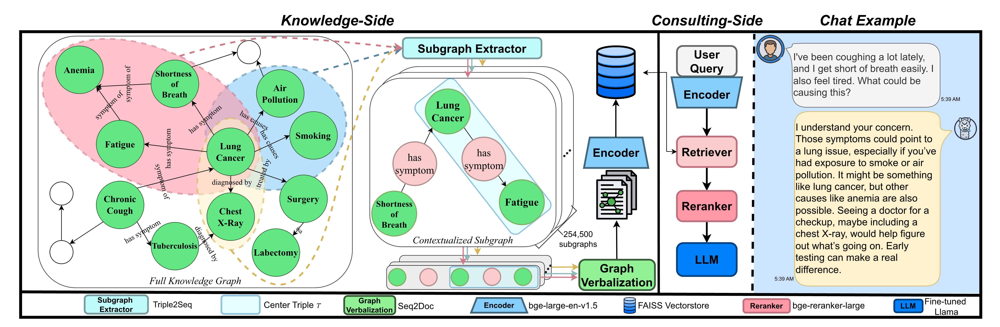
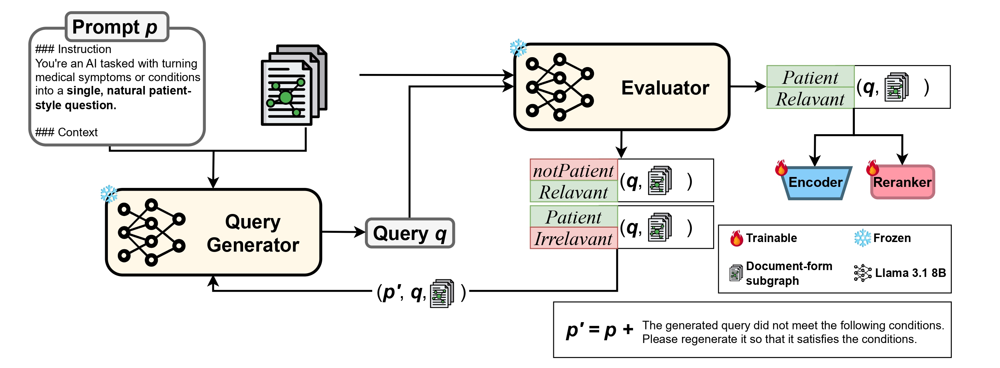

# 🩺 ILlama
> *Leveraging Knowledge Graph-Enhanced LLMs for Context-Aware Medical Consultation* (EMNLP 2025).  
> A novel RAG framework leveraging structured medical knowledge via subgraphs for context-aware, hallucination-reduced medical consultations.

---

## 🗝️ Key feature
- ✅ **Reliable Medical Facts**: Reduces errors with clear causal relationships.
- 🔎 **Accurate Retrieval**: Uses granular knowledge and vector search for higher precision.
- 💉 **Superior Clinical Utility**: Achieves state-of-the-art performance for reliable and practical medical guidance.

<p align="center">
  
</p>

<p align="center">
  
</p>

---

## 📖 Usage
### Installation
Install dependent Python libraries by running the command below.
```
pip install -r requirements.txt
```

### Quick Start Example
```python
import asycnio
from illama.illama import ILlama

illama = ILlama(
        model_name='Codingchild/ILlama-8b-LoRA',
        retriever_name='Codingchild/medical-bge-large-en-v1.5',
        reranker_name='Codingchild/medical-bge-reranker-large',
    )

async def main():
    # prepare illama model & prompt
    chain = illama.prepare_illama(
        generation_type='w_rag'
    )

    # generate response for user's query
    response = await illama.inference(
        chain=chain,
        query='I have a headache and a fever. What should I do?'
    )

    print(response)

asyncio.run(main())
```

## 📜 Citation
If you find this work helpful, please consider citing us:
```bibtex
@inproceedings{
  park2025leveraging,
  title={Leveraging Knowledge Graph-Enhanced {LLM}s for Context-Aware Medical Consultation},
  author={Su-Hyeong Park and Ho-Beom Kim and Seong-Jin Park and Dinara Aliyeva and Kang-Min Kim},
  booktitle={The 2025 Conference on Empirical Methods in Natural Language Processing},
  year={2025},
  url={https://openreview.net/forum?id=fEOxao65k9}
}
```

## 📬 Contact
Email: pshpulip22@catholic.ac.kr
